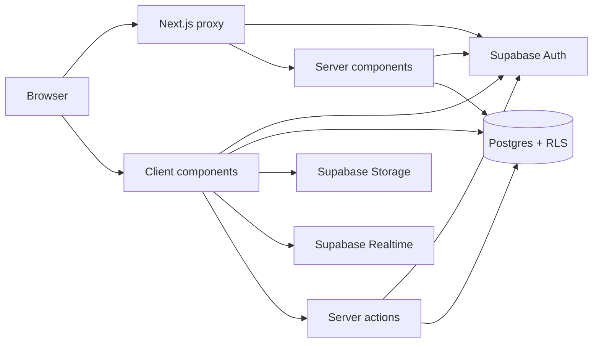
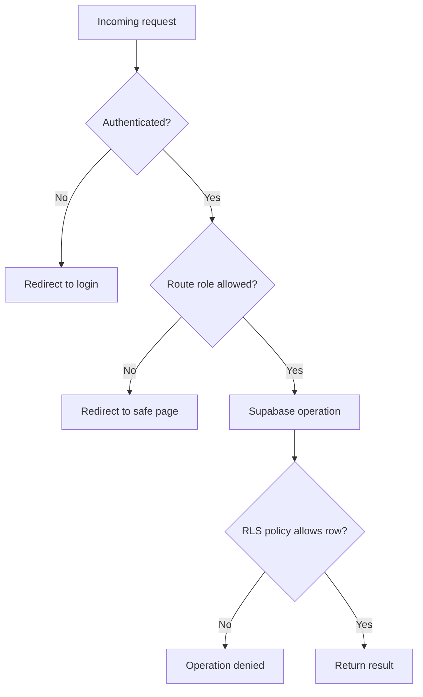

# Architecture

## System Overview

AURA is a Next.js App Router application backed directly by Supabase. Server
components load initial page data, client components handle interactive
workflows, and Postgres RLS remains the final authorization boundary.

## Request Lifecycle

1. `proxy.ts` refreshes the Supabase session and redirects anonymous users away
   from protected routes.
2. Server pages create a cookie-aware client with
   `lib/supabase/server.ts`.
3. Pages load the authenticated profile and feature data.
4. Interactive client components use `lib/supabase/client.ts`.
5. Postgres evaluates RLS policies for every database operation.
6. Realtime subscriptions refresh notifications and live application views.

## Application Layers

### Routing

The `app/` directory contains the application surfaces:

| Area | Routes | Responsibility |
| --- | --- | --- |
| Authentication | `/login`, `/register`, `/reset-password`, `/auth/callback` | Account access and OAuth callback |
| Student | `/`, `/learning`, `/course/*`, `/community` | Discovery and learning workflows |
| Teacher | `/teacher/*` | Course, student, assignment, quiz, and analytics tools |
| Admin | `/admin/*` | Platform administration, moderation, and audit activity |

Most data-backed pages use `force-dynamic` so authentication and database state
are evaluated per request.

### Components

Components are grouped by feature under `components/`. Server pages pass an
initial data snapshot to interactive client workspaces. Client components then
perform permitted Supabase mutations and call `router.refresh()` when the
server-rendered view must be synchronized.

### Domain Operations

Reusable server-side operations live in `lib/`:

- `lib/auth/`: users, roles, permissions, guards, and safe redirects
- `lib/course/`: enrollment, lesson progress, and course reviews
- `lib/analytics/`: pure progress and activity calculations
- `lib/supabase/`: browser and cookie-aware Supabase clients

### Data and Events

Supabase provides four infrastructure capabilities:

- Auth owns identity and sessions.
- Postgres stores application records and applies RLS.
- Storage holds course thumbnails and assignment submissions.
- Realtime publishes notification, communication, enrollment, progress, and
  dashboard-relevant table changes.

Database triggers create notifications and audit records. This keeps those
events consistent regardless of which UI initiated a mutation.

## Authorization

Authorization is intentionally layered:

Application roles are `student`, `pending_teacher`, `teacher`, and `admin`.
Route checks improve user experience, but RLS is the security boundary.

## Key Design Decisions

- Prefer server components for initial reads and protected page composition.
- Use client Supabase calls for rich workspaces that require immediate UI
  feedback.
- Keep reusable mutations as server actions when they need cache revalidation
  or redirects.
- Keep business calculations pure and testable outside React.
- Store audit and notification logic in database triggers.
- Treat SQL files as ordered, idempotent migrations for this repository.

## Deployment

The application can be deployed to any Next.js-compatible host. Production
requires the two public Supabase environment variables and matching Supabase
auth redirect URLs. Run `npm run build` before deployment.
