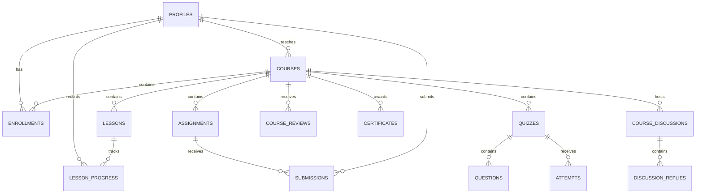

# Database Schema

## Setup

Run schema files in the order documented in the root README. The SQL is
idempotent and combines table creation, compatibility alters, policies,
functions, triggers, indexes, storage configuration, and Realtime publication.

## Entity Relationships

## Core Tables

| Table | Purpose | Important constraints |
| --- | --- | --- |
| `profiles` | Application profile for `auth.users` | Role is student, pending teacher, teacher, or admin |
| `courses` | Course catalog and teacher ownership | Progress 0-100; drafts hidden from public policy |
| `lessons` | Ordered course learning content | Cascades when a course is deleted |
| `enrollments` | Student-course relationship | Unique user/course; progress 0-100 |
| `lesson_progress` | Per-user lesson completion | Unique user/lesson |
| `notes` | Private student notes | Owner-scoped through `user_id` |

## Assessment Tables

| Table | Purpose | Important constraints |
| --- | --- | --- |
| `assignments` | Teacher-created coursework | Positive maximum grade |
| `submissions` | Student file submissions and reviews | Unique assignment/student; submitted or reviewed |
| `quizzes` | Course or platform quizzes | Published state controls student visibility |
| `questions` | MCQ and true/false questions | Positive points; ordered per quiz |
| `attempts` | Scored student attempts | One attempt per quiz/student |

## Engagement Tables

| Table | Purpose | Important constraints |
| --- | --- | --- |
| `course_reviews` | Enrolled student feedback | One review per course/student; rating 1-5 |
| `certificates` | Completion credentials | One certificate per user/course |
| `notifications` | User event inbox | JSON metadata and nullable read timestamp |
| `direct_messages` | Student, teacher, and admin messages | Body length 1-4000 |
| `course_discussions` | Course forum topics | Lock and moderation visibility flags |
| `discussion_replies` | Forum replies | Hidden flag supports moderation |
| `platform_announcements` | Global, role, or course announcements | Audience enum and optional expiry |
| `moderation_flags` | User reports for community content | Open, resolved, or dismissed |
| `audit_logs` | Immutable platform activity trail | Identity primary key and JSON change details |

## Row Level Security

RLS is enabled on all application tables. The main access rules are:

- Students own their notes, enrollments, progress, submissions, attempts,
  reviews, certificates, and notifications.
- Teachers manage courses and learning content they own.
- Course members can access discussions and course-scoped announcements.
- Admins can manage platform records and read audit logs.
- Published courses are readable through the catalog policy; teacher-owned
  drafts are available through teacher-specific policies.

The helper functions `is_admin()` and `is_teacher()` centralize role checks.
Application route guards supplement RLS but do not replace it.

## Triggers and Functions

| Function or trigger | Responsibility |
| --- | --- |
| `handle_new_user()` | Creates a profile after Auth signup; teacher requests become pending |
| `delete_user_by_admin()` | Secure admin deletion of Auth users |
| `touch_course_review_updated_at()` | Maintains review update timestamps |
| `notify_assignment_review()` | Notifies a student after grading |
| `notify_quiz_result()` | Notifies a student after a quiz attempt |
| `notify_teacher_approval()` | Notifies a newly approved teacher |
| `notify_new_lesson()` | Notifies students enrolled in a changed course |
| `audit_row_change()` | Records insert, update, and delete details |
| `get_communication_contacts()` | Resolves allowed direct-message contacts |

## Storage

| Bucket | Visibility | Use |
| --- | --- | --- |
| `course-thumbnails` | Public read | Teacher-uploaded course images |
| `assignment-submissions` | Public read | Student assignment PDF submissions |

Upload policies require authentication. Paths should include the owning user ID
and a generated filename to avoid collisions.

## Realtime

The Realtime publication includes:

- `notifications`
- `direct_messages`
- `course_discussions`
- `discussion_replies`
- `platform_announcements`
- `profiles`
- `courses`
- `lessons`
- `enrollments`
- `lesson_progress`
- `attempts`
- `submissions`
- `audit_logs`

When adding a live feature, add its table to the publication idempotently and
keep the client subscription filtered to the smallest useful row set.

## Schema Change Checklist

1. Add an idempotent SQL change.
2. Add or update foreign keys, indexes, and validation constraints.
3. Enable RLS and define policies before exposing the feature.
4. Update relevant TypeScript types.
5. Add Realtime publication only when live updates are required.
6. Update this document and test every affected role.
